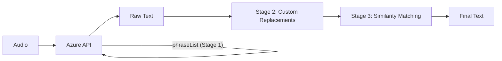

# Correction Pipeline

The integration uses a three-stage correction pipeline to improve recognition accuracy:



- **Stage 1**: Pre-recognition hints — auto-collected + custom phrases sent to Azure *before* recognition
- **Stage 2**: Custom string replacement rules — applied *after* recognition
- **Stage 3**: Fuzzy/phonetic similarity matching — automatic correction *after* recognition

## Stage 1: Pre-recognition Hints

Phrases are sent to Azure as `phraseList` hints **before** recognition, biasing the model toward known words.

Phrases come from two sources:

1. **Auto-collected phrases** — names gathered from HA registries. Each source can be independently enabled/disabled in the **Auto-collect Phrases** section of the settings:

| Source | Description |
|--------|-------------|
| Floors | Floor names and aliases |
| Areas | Area names and aliases |
| Devices | User-assigned or original device names |
| Exposed Entities | Names of entities exposed to the "conversation" assistant |

2. **Custom phrases** — user-defined domain-specific words added in the Pre-recognition Hints section.

Auto-collected and custom phrases are shared by both Stage 1 (API phraseList) and Stage 3 (similarity matching targets). Phrase lists are cached and automatically invalidated when entity, area, device, or floor registries change.

> **Note:** `phraseList` is only supported by the Fast Transcription API. When the Real-time API is used (either for Real-time-only locales like `zh-TW`, or when only Real-time is enabled in settings), phrases are still collected but only used as matching targets for Stage 3 similarity matching.

## Stage 2: Custom Replacement Rules

User-defined string substitution rules applied **after** recognition. Useful for fixing consistent misrecognitions.

Format: `wrong=correct` (one per line)

English example:
```
livin room=living room
kichen light=kitchen light
```

Chinese example:
```
循環3=循環扇
關閉電始=關閉電視
```

## Stage 3: Similarity Matching

Automatic fuzzy/phonetic matching against known phrases (from Stage 1). Uses language-specific matchers:

| Matcher | Languages | Method |
|---------|-----------|--------|
| **PinyinMatcher** | Mandarin Chinese (`zh-CN`, `zh-TW`) | Converts to pinyin, compares via `SequenceMatcher` |
| **DefaultMatcher** | All other languages | Word-boundary-aware `SequenceMatcher` |

> **Note:** PinyinMatcher only activates for Mandarin locales (`zh-CN*`, `zh-TW`).

Features:
- Sliding window comparison at varying sizes
- Protected regions prevent over-correction of already-correct substrings
- Length ratio weighting prefers similar-length matches
- Configurable threshold (0.5--1.0, default: 0.80)

English example: "turn on the livin room lite" may match "living room light" if similarity exceeds the threshold.

Chinese example: "打開入口燈" — pinyin matching allows "入口等" (rù kǒu děng) to be distinguished from "入口燈" (rù kǒu dēng).
